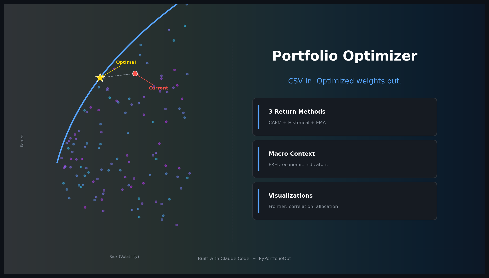

# PortfolioAnalysis

<p align="center">
  
</p>

Portfolio optimization and US macro analysis tool powered by Claude. Provide your holdings, get optimized allocation recommendations with macro context.

## What It Does

- Parses your portfolio from CSV (E-Trade, Schwab, or generic format) or plain text
- Downloads historical price data via Yahoo Finance
- Calculates optimal allocation using 3 expected return methods (CAPM, Mean Historical, EMA)
- Analyzes key US economic indicators (interest rates, unemployment, inflation, GDP)
- Generates charts and a markdown report with rebalancing recommendations

## Prerequisites

- Python 3.10+
- [Claude Desktop](https://claude.ai/download) (Cowork mode) or [Claude Code](https://docs.anthropic.com/en/docs/claude-code)

## Setup

1. **Clone the repository**
   ```bash
   git clone https://github.com/sk2977/PortfolioAnalysis-Public.git
   cd PortfolioAnalysis-Public
   ```

2. **Create a virtual environment**
   ```bash
   python -m venv venv

   # Windows
   venv\Scripts\activate

   # Mac/Linux
   source venv/bin/activate
   ```

3. **Install dependencies**
   ```bash
   pip install -r requirements.txt
   ```

4. **Open with Claude**
   - **Claude Desktop**: Open the project folder in Cowork mode
   - **Claude Code**: Run `claude` in the project directory

## Getting Started with Claude Cowork

Cowork is Claude's built-in code execution environment. It runs the Python scripts in this project directly -- no API key needed.

1. **Clone and install** (see Setup above)

2. **Open Claude Desktop** and start a new conversation

3. **Link the project folder**
   - Click "Add to project" (or drag the folder into Claude Desktop)
   - Select the cloned `PortfolioAnalysis-Public` directory

4. **Upload your portfolio**
   - Click the attachment button and upload your CSV or XLSX file
   - Or describe your holdings in plain text (e.g., "40% VTI, 30% BND, 30% QQQ")

5. **Start the analysis**
   - Type: "Run portfolio analysis using the uploaded file"
   - Or use the prompts in [prompt.md](prompt.md)

Claude will run each pipeline step, ask about your risk tolerance, and deliver a report with macro context, optimized allocations, and qualitative commentary.

## Usage

See [prompt.md](prompt.md) for the full user guide. Quick examples:

**Use the sample portfolio:**
> "Run portfolio analysis using sample_portfolio.csv"

**Provide your own CSV:**
> "Analyze my portfolio from my_holdings.csv"

**Describe holdings in plain text:**
> "Analyze my portfolio: 40% VTI, 25% QQQ, 15% BND, 10% SCHD, 10% VYM"

**Customize risk tolerance:**
> "I'm conservative - optimize for minimum volatility"

## CSV Format

The simplest format:

```csv
Symbol,Shares,Price
AAPL,50,175.00
MSFT,30,380.00
VTI,100,220.00
```

E-Trade and Schwab CSV exports are also auto-detected.

## Project Structure

```
PortfolioAnalysis-Public/
├── CLAUDE.md              # Instructions for Claude (the orchestration brain)
├── prompt.md              # User-facing guide
├── README.md              # This file
├── requirements.txt       # Python dependencies
├── sample_portfolio.csv   # Example portfolio
├── scripts/
│   ├── parse_portfolio.py # CSV parsing (multi-format)
│   ├── market_data.py     # Yahoo Finance downloads + caching
│   ├── macro_analysis.py  # Key economic indicators from FRED
│   ├── optimize.py        # pyportfolioopt optimization
│   ├── visualize.py       # Chart generation (PNGs)
│   └── report.py          # Markdown report generation
├── data_cache/            # (gitignored) Pickle cache for API data
└── output/                # (gitignored) Generated reports and charts
```

## How It Works

1. **Portfolio Input**: Claude parses your holdings from CSV or text
2. **Q&A**: Claude asks about exclusions, risk tolerance, and constraints
3. **Data Download**: Historical prices fetched from Yahoo Finance (cached locally)
4. **Macro Analysis**: Key economic indicators fetched from FRED (rates, employment, inflation, growth)
5. **Optimization**: Three expected return methods (CAPM, Mean, EMA) are optimized independently, then combined via weighted average
6. **Output**: Charts, markdown report, and conversational analysis

No API keys required -- Claude provides the AI layer directly.

## License

[MIT](LICENSE)
